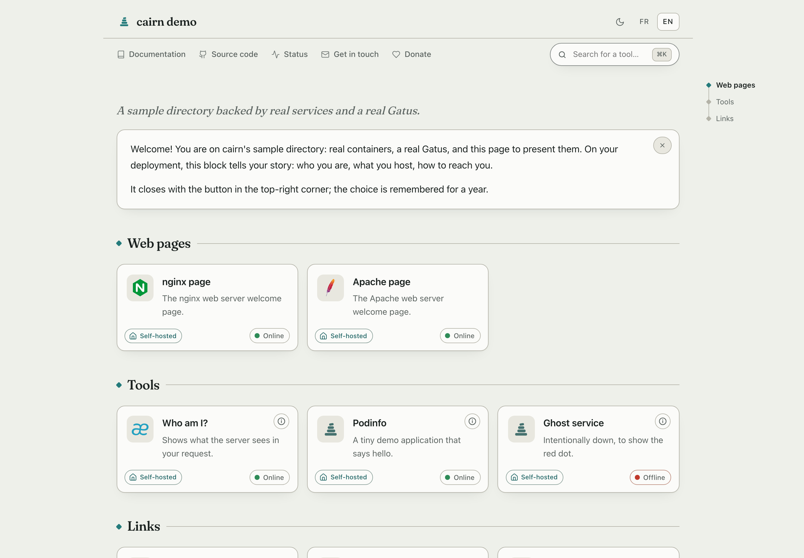

<div align="center">

#  cairn

**The directory page for the people you host services _for_.**

[](https://github.com/MorganKryze/cairn/actions/workflows/build.yml)
[](LICENSE)
[](https://go.dev)
[](https://github.com/MorganKryze/cairn/pkgs/container/cairn)
[](docs/deployment/docker-compose.md)

</div>

> A cairn is a small stack of stones left by hikers who walked the trail
> before you, so you find your way without digging.

<div align="center">

<picture>
  <source media="(prefers-color-scheme: dark)" srcset="docs/assets/home-dark.png">
  
</picture>

</div>

---

Your family, your clients, your friends: they don't want a dashboard, they
want to know what this place is, what each tool does, and whether it works
right now. cairn is that page. Written in their language, readable without an
account or a manual, and boring for you to operate.

## What your visitors get

- **A welcome note in your words**: who hosts this, for whom, how to reach
  you. Dismissable, remembered for a year (a plain cookie, no tracking).
- **Tools grouped by need**, one plain sentence each, with optional "Learn
  more" pages for the curious.
- **Live status pills** fed by your [Gatus](https://github.com/TwiN/gatus),
  each linking to its own endpoint page. Your server does the polling,
  never the visitor's browser.
- **Their language**: the server picks it from the browser, a switcher pins
  it. One config file, translations inline.
- **Search from anywhere**: just start typing, or ⌘K. Works accent-insensitive
  over names, descriptions and hidden tags.
- **Calm typography, light and dark, keyboard-friendly**, and every feature
  degrades gracefully without JavaScript.

## What you get as the operator

- **One binary, `FROM scratch`, ~14 MB**, zero runtime dependencies, no
  database, no tracking.
- **YAML mounted read-only**; edits apply live within seconds, and a config
  error names the file, the line and the expected shape instead of taking the
  site down.
- **Legal pages served by cairn itself** (legal notice, privacy…): the pages
  self-hosters never have anywhere to put.
- The strictest container settings just work: `read_only`, `cap_drop: ALL`,
  self-probing healthcheck. See the [hardened compose](docs/deployment/docker-compose.md).

## Quickstart

Two files, one command:

```yaml
# config/services.yaml
- id: pdf
  url: https://pdf.example.org
  icon: stirling-pdf
  name: PDF toolbox
  desc: Merge, split, compress your PDFs.
```

(Want two languages? `name: { fr: Boîte à outils PDF, en: PDF toolbox }`;
every text key works both ways. See [Languages](docs/configuration/i18n.md).)

```yaml
# compose.yaml
services:
  cairn:
    image: ghcr.io/morgankryze/cairn:latest
    ports: ['8080:8080']
    volumes: ['./config:/config:ro']
```

```sh
docker compose up -d
```

Open <http://localhost:8080>: that is a finished page. Everything else
(title, languages, categories, status, theming) is one optional key at a
time, at your pace: follow [Getting started](docs/getting-started.md).

Prefer to see it live first? The [demo stack](demo/README.md) spins up
cairn, a real Gatus and a handful of sample services, one intentionally
dead, in one command:

```sh
git clone https://github.com/MorganKryze/cairn.git && cd cairn/demo
docker compose up -d --build
```

## Documentation

Everything lives in [docs/](docs/README.md):

|               |                                                                                                                                                                      |
| ------------- | -------------------------------------------------------------------------------------------------------------------------------------------------------------------- |
| **Start**     | [Getting started](docs/getting-started.md), the five-minute path                                                                                                     |
| **Configure** | [Services](docs/configuration/services.md) · [Site](docs/configuration/site.md) · [Theming](docs/configuration/theming.md) · [Languages](docs/configuration/i18n.md) |
| **Deploy**    | [Docker Compose](docs/deployment/docker-compose.md) · [Reverse proxies](docs/deployment/reverse-proxies.md)                                                          |
| **Recipes**   | [Status page with Gatus](docs/recipes/gatus.md) · [Icons](docs/recipes/icons.md) · [Multiple files](docs/recipes/multiple-files.md)                                  |
| **Look up**   | [Reference](docs/reference.md) · [FAQ](docs/faq.md) · [Comparison](docs/comparison.md)                                                                               |

## Not a dashboard, on purpose

cairn is a directory, not a control panel: no auth, no widgets, no Docker
socket, no admin UI. If the audience is _you_, the admin,
[Homepage](https://github.com/gethomepage/homepage) or
[Homer](https://github.com/bastienwirtz/homer) will make you happier; the
[comparison](docs/comparison.md) is honest about it.

## License

Free software under [GPL-3.0](LICENSE): use it, modify it, share it. What
you redistribute stays under the same license, source included. Hosting your
own instance is not distribution and asks nothing of you.
