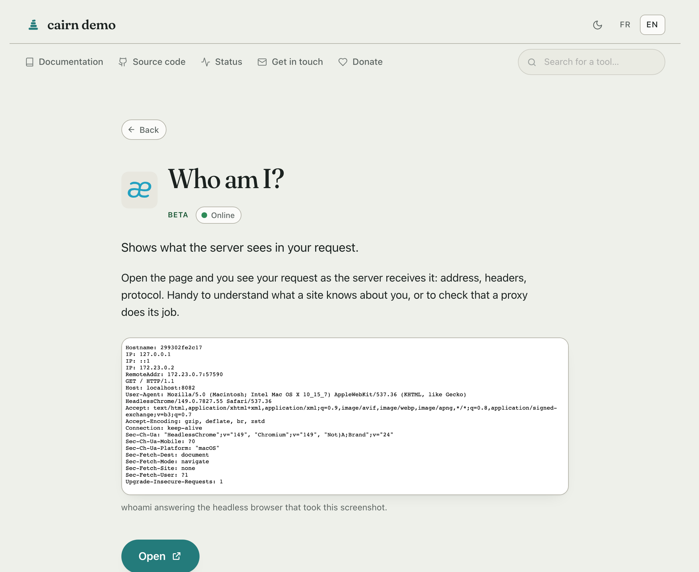
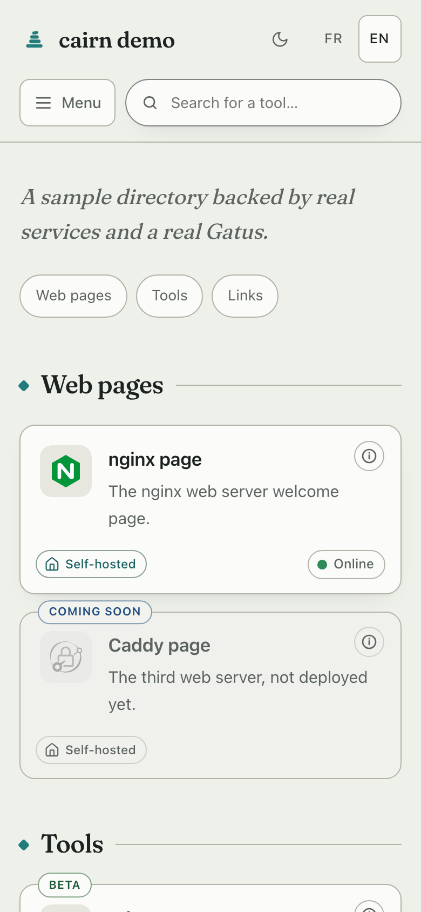

<div align="center">

# <sub></sub> cairn

**The directory page for the people you host services _for_.**

[](https://github.com/MorganKryze/cairn/actions/workflows/build.yml)
[](https://github.com/MorganKryze/cairn/actions/workflows/security.yml)
[](https://github.com/MorganKryze/cairn/actions/workflows/build.yml)
[](https://github.com/MorganKryze/cairn/actions/workflows/build.yml)
[](https://github.com/MorganKryze/cairn/releases)
[](LICENSE)

[](https://github.com/MorganKryze/cairn/stargazers)
[](https://github.com/MorganKryze/cairn/releases)
[](https://github.com/MorganKryze/cairn/pkgs/container/cairn)
[](https://go.dev)
[](docs/deployment/helm.md)
[](docs/deployment/kubernetes.md)
[](https://context7.com/morgankryze/cairn)

</div>

> A cairn is a small stack of stones left by hikers who walked the trail
> before you, so you find your way without digging.

<div align="center">

<a href="https://cairn.libresoftware.cloud" title="Open the live demo">
<picture>
  <source media="(prefers-color-scheme: dark)" srcset="docs/assets/home-dark.png">
  
</picture>
</a>

</div>

---

Your family, your clients, your friends: they don't want a dashboard, they
want to know what this place is, what each tool does, and whether it works
right now. cairn is that page. Written in their language, readable without an
account or a manual, and boring for you to operate.

## 🧭 What your visitors get

👋 **A welcome note in your words**: who hosts this, for whom, how to
reach you. Dismissable, remembered for a year (a plain cookie, no
tracking).

🗂️ **Tools grouped by need**, one plain sentence each, with optional
"Learn more" pages for the curious.

🚦 **Live status pills** fed by the monitor you already run, whichever it
is, each linking to its status page. Your server does the polling, never
the visitor's browser.

🌍 **Their language**: the server picks it from the browser, a switcher
pins it. One config file, translations inline.

🔍 **Search from anywhere**: just start typing, or ⌘K. A name finds that
one service, not everything that mentions it; keyword search still reaches
descriptions and hidden tags, accent-insensitive.

📱 **At home on a phone**: the layout reflows to one hand, the header steps
aside as you scroll and returns the moment you head back up, and a burger
keeps search within thumb's reach.

♿ **Built to stay readable**: text contrast measured against WCAG AA in both
themes, a skip link, named landmarks, search results announced through a
live region, a theme toggle that says which way it is set, and
right-to-left languages laid out the right way round. The controls a
visitor can operate, the search box and the phone's jump-to select, carry a
boundary that clears 3:1, remeasured in a real browser on every pull
request. Tested with a browser, never audited as a whole, and not yet with a
real screen reader: if you use one,
[tell us what breaks](https://github.com/MorganKryze/cairn/issues).

🌗 **Calm typography, light and dark, keyboard-friendly**, and every
feature degrades gracefully without JavaScript.

<div align="center">
<table>
<tr>
<td width="62%" valign="top">
<a href="https://cairn.libresoftware.cloud/en/whoami/" title="Open a detail page on the live demo"></a>
<p align="center"><em>Behind a card, when a visitor wants more than one sentence.</em></p>
</td>
<td width="38%" valign="top">
<a href="https://cairn.libresoftware.cloud" title="Open the live demo"></a>
<p align="center"><em>And in a hand.</em></p>
</td>
</tr>
</table>
</div>

## 🛠️ What you get as the operator

📦 **One static binary, about 10 MB**, zero runtime dependencies, no
database. The image around it is 4.4 MB to pull on amd64 and 4.0 on arm64,
since that binary compresses well.

📝 **YAML mounted read-only**; edits apply live within seconds, and a config
error names the file, the line and the expected shape instead of taking the
site down.

📜 **Legal pages served by cairn itself** (legal notice, privacy…): the
pages self-hosters never have anywhere to put. Written in ordinary
[markdown](docs/configuration/text.md), headings and lists and tables, with
raw HTML left as text so a config file can never reach the page as markup.

🌐 **Wherever your domain has room**: a domain, a subdomain, or a sub-path of
one you already use (`example.org/cairn/`, one flag). cairn handles the
prefix itself, so the [proxy](docs/deployment/reverse-proxies.md) needs no
rewriting rule.

## 🟢 Whatever already tells you it is up

cairn does not ask you to change monitors. It reads the one you run, and the
pills come from your server, never from the visitor's browser.

|                 |                                                                                                                                                                                                                                                |
| --------------- | ---------------------------------------------------------------------------------------------------------------------------------------------------------------------------------------------------------------------------------------------- |
| **Self-hosted** | [Gatus](https://github.com/TwiN/gatus) · [Uptime Kuma](https://github.com/louislam/uptime-kuma) · [Cachet](https://github.com/cachethq/cachet) · [Statping-ng](https://github.com/statping-ng/statping-ng) · [Upptime](https://upptime.js.org) |
| **Hosted**      | [Atlassian Statuspage](https://www.atlassian.com/software/statuspage) · [Instatus](https://instatus.com) · [UptimeRobot](https://uptimerobot.com) · [Better Stack](https://betterstack.com/uptime) · [StatusCake](https://www.statuscake.com)  |

Every one of those was read from a live instance rather than from a manual, and
the mapping each needed is written down with the count that came back. Anything
else publishing a list of names and states takes six lines of configuration:
[which monitors cairn reads](docs/recipes/status.md#which-monitors-cairn-reads)
also says what cannot be read, and why.

<table>
<tr>
<td width="86" align="center" valign="middle">
<a href="https://github.com/TwiN/gatus"></a>
</td>
<td valign="middle">

**[Gatus](https://github.com/TwiN/gatus) gets the warmest handshake, and has earned it.**
It is the only one cairn integrates with **both ways**, since `cairn -emit-gatus`
writes its endpoint config out of your services, and the only one whose pills
link to a page per service rather than to one page for everything. If you have
no monitor yet, start there.

</td>
</tr>
</table>

## 🔒 Secure by subtraction

The safest surface is the one that isn't there: cairn stores nothing, signs no
one in, and takes no input it has to trust. What little runs is kept
deliberately tight, from the image down to the wire.

🪨 **`FROM scratch`, non-root**: no shell, no package manager, no libc in
the image, so a compromised process has nothing to pivot into.

🛡️ **Runs locked down**: `read_only`, `cap_drop: ALL` and a self-probing
healthcheck all work out of the box. See the [hardened compose](docs/deployment/docker-compose.md).

🧱 **A strict Content-Security-Policy** (`default-src 'none'`, inline
fragments pinned by hash) and the hardening headers, with no third-party
script or font to trust.

🔌 **No outbound requests of its own**: air-gap friendly, its only companions
optional and yours, a self-hosted [monitor](docs/recipes/status.md) for status
and icons you can [serve yourself](docs/recipes/icons.md#going-fully-self-hosted).
The [demo](demo/README.md) runs on a network with no route out and serves its
own icons, so the page it shows you makes no third-party request at all.

🔬 **A watched supply chain**: every pull request runs `govulncheck`, a Trivy
image scan and CodeQL, and they run again on the pushes that change code and
weekly on a schedule. Dependabot follows the dependencies, and every CI action
is pinned to a commit rather than a movable tag, as is the buildkit image that
runs the build.

🧪 **More test than product**: about 8 800 lines of tests against 6 000 of
code, 505 of them run on every pull request, and 92.9% of the statements are
covered with an 87% floor that fails the build. A browser suite drives what
markup cannot show, and every one of those tests was made to fail before the
fix it covers, by patching the fix out and reading the red.

✍️ **Artifacts you can check**: the image is signed with cosign and ships SLSA
provenance and an SBOM; the release binaries carry their own attestation.
The [verification commands](SECURITY.md#verifying-what-you-pulled) are two
lines.

## ⚡ Quickstart

Nothing to write, nothing to mount, just look at it:

```sh
docker run --rm -p 8080:8080 ghcr.io/morgankryze/cairn:stable
```

That is a running cairn on <http://localhost:8080>, telling you what to feed
it. When you are ready to feed it, two files and one command:

```yaml
# config/services.yaml
- id: pdf
  url: https://pdf.example.org
  icon: stirling-pdf
  name: PDF toolbox
  desc: Merge, split, compress your PDFs.
```

(Want two languages? `name: { fr: Boîte à outils PDF, en: PDF toolbox }`;
every text key works both ways. See [Languages](docs/configuration/i18n.md).)

```yaml
# compose.yaml
services:
  cairn:
    image: ghcr.io/morgankryze/cairn:latest
    ports:
      - 8080:8080
    volumes:
      - ./config:/config:ro
```

```sh
docker compose up -d
```

Open <http://localhost:8080>: that is a finished page. Everything else
(title, languages, categories, status, theming) is one optional key at a
time, at your pace: follow [Getting started](docs/getting-started.md).

Prefer to see it live first? A public instance runs at
**<https://cairn.libresoftware.cloud>**, and the [demo stack](demo/README.md)
spins up your own copy, with a real Gatus and a handful of sample services,
one intentionally dead, in one command:

```sh
git clone https://github.com/MorganKryze/cairn.git && cd cairn/demo
docker compose up -d --build
```

## 📚 Documentation

Everything lives in [docs/](docs/README.md), and it is written to be read, not
just grepped: each page teaches the why before the how, in plain prose a
developer can enjoy rather than a reference dump to endure. If you like
understanding how a thing works, start anywhere below.

|               |                                                                                                                                                                                                                                                                                                                        |
| ------------- | ---------------------------------------------------------------------------------------------------------------------------------------------------------------------------------------------------------------------------------------------------------------------------------------------------------------------- |
| **Start**     | [Getting started](docs/getting-started.md), the five-minute path · [Upgrading](docs/upgrading.md), what a new version can refuse and how to fix it                                                                                                                                                                     |
| **Configure** | [Services](docs/configuration/services.md) · [Site](docs/configuration/site.md) · [Text](docs/configuration/text.md) · [Theming](docs/configuration/theming.md) · [Languages](docs/configuration/i18n.md)                                                                                                              |
| **Deploy**    | [Docker Compose](docs/deployment/docker-compose.md) · [Podman](docs/deployment/podman.md) · [Bare binary](docs/deployment/binary.md) · [Kubernetes](docs/deployment/kubernetes.md) · [Helm](docs/deployment/helm.md) · [Air-gapped](docs/deployment/airgap.md) · [Reverse proxies](docs/deployment/reverse-proxies.md) |
| **Recipes**   | [Status page](docs/recipes/status.md) · [Icons](docs/recipes/icons.md) · [Multiple files](docs/recipes/multiple-files.md) · [Migration](docs/recipes/migration.md)                                                                                                                                                     |
| **Look up**   | [Reference](docs/reference.md) · [FAQ](docs/faq.md) · [Comparison](docs/comparison.md)                                                                                                                                                                                                                                 |

### 🤖 And for the assistant reading over your shoulder

Those pages are indexed on
**[Context7](https://context7.com/morgankryze/cairn)**, so an assistant with
the Context7 MCP server can pull cairn's real documentation instead of
inventing config keys that never existed. Ask it for `morgankryze/cairn` by
name.

## 🎯 Not a dashboard, on purpose

cairn is a directory, not a control panel: no auth, no widgets, no Docker
socket, no admin UI. If the audience is _you_, the admin,
[Homepage](https://github.com/gethomepage/homepage) or
[Homer](https://github.com/bastienwirtz/homer) will make you happier; the
[comparison](docs/comparison.md) is honest about it.

## 🤝 Ideas, contributions, support

cairn is young and opinionated, and other people's eyes make it better.
Ideas and bug reports are welcome in the
[issues](https://github.com/MorganKryze/cairn/issues), code and docs through
[contributing](CONTRIBUTING.md), always within the scope above. And if cairn
serves your people well, a [coffee](https://ko-fi.com/morgankryze) keeps its
maintainer walking the trail.

## 🪶 Colophon

A colophon tells how the book was made, so here is mine: Go, plain YAML,
[Fraunces](https://github.com/undercasetype/Fraunces) for the headings, and
[Claude Code](https://claude.com/claude-code) drafting at my side, never on
autopilot. The taste, the reviews and the final word stay mine; the tests,
the CI and the public history keep me honest.

## ⚖️ License

Free software under [GPL-3.0](LICENSE): use it, modify it, share it. What
you redistribute stays under the same license, source included. Hosting your
own instance is not distribution and asks nothing of you.
